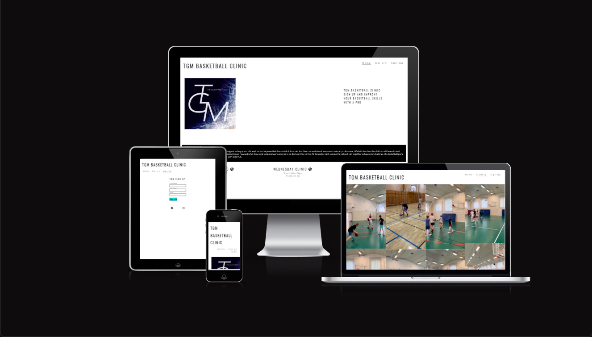
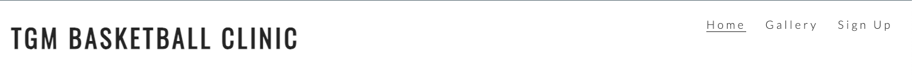
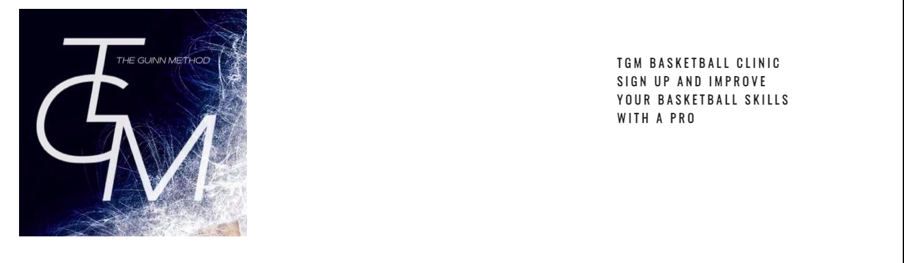
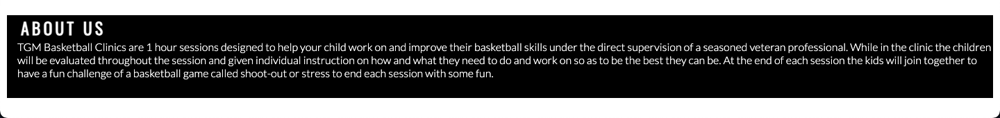
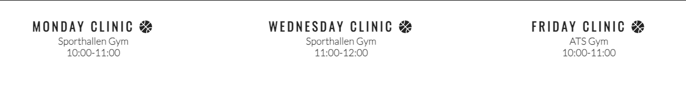
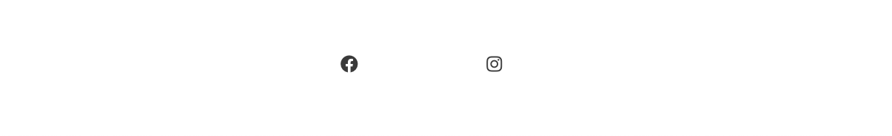
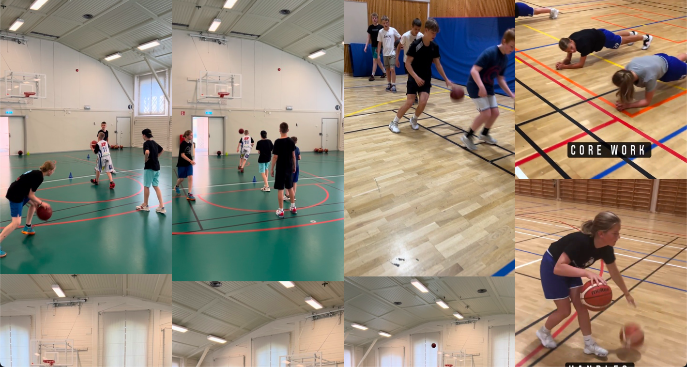
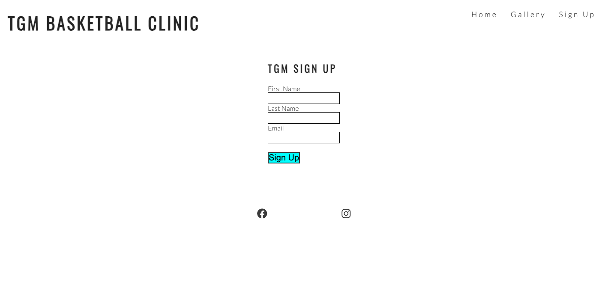
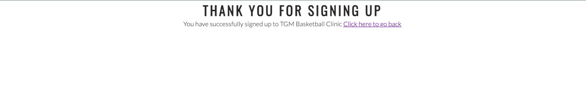
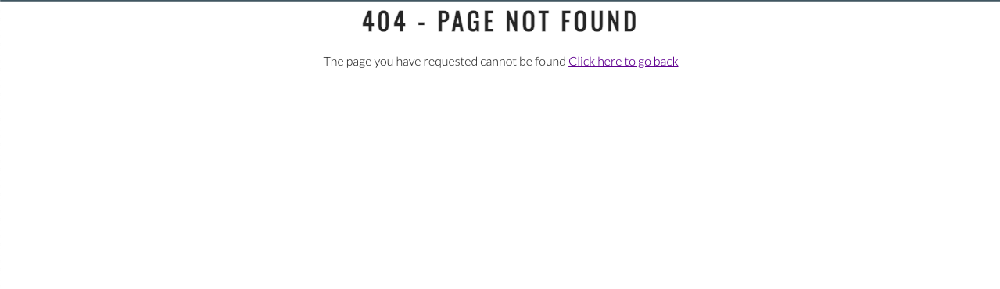

# TGM Basketball Clinic

TGM Basketball Clinic is a place for children ages 12 and up to join and work on their basketball skills and physical fitness that will be useful when playing basketball.  This site will target parents or guardians who have children that play basketball and want every opportunity to improve upon their skills.  This site will give the opportunity for parents or guardians to sign up their children for a time and location to be at to join in on the skills clinic.

# Table of Contents

# Features

## Navigation Bar

        Shown on all 3 pages, A fully responsive navigation bar including links to the Logo, Home page, Gallery and Sign Up page.  Navigation bar is the same on each page for easy navigation.

        This will allow any user to easily navigate throughout the site on any device without having to use the "back" button.

## Main Page Image

        The Main page includes a picture of the clinics adtertisement model and some text for the user to sign up their children.
        This section introduces the user to TGM Basketball Clinic with a photo that catches their attention.

## About TGM Clinics

        TGM Basketball Clinics are 1 hour sessions designed to help your child work on and improve their basketball skills under the direct supervision of a seasoned veteran professional.
        While in the clinic the children will be evaluated throughout the session and given individual instruction on how and what they need to do and work on so as to be the best they can be.
        At the end of each session the kids will join together to have a fun challenge of a basketball game called shoot-out or stress to end each session with some fun.

## Gym Times and Locations

        The times and locations section allows the user to see when the clinics are happeing, where they will be located and for how long they will last.
        

## Footer section

        The footer section has social links to the TGM Clinic media sites.  The links will open in new tabs so as to allow easy navigation for the user.
        The social links encourage the users to keep in contact and connected through the media sites

## Gallery

        The Gallery shows images of previous TGM Clinics for the user to look at and see what the clinics involve and are about.
        This section lets the user see some of the activities their kids will take part in.

## Sign Up

        This Sign Up section is a form that allows the user to sign up their kids and afterwards get a thank you message to let them know they have signed up successfully.

## Thank you page

        This page lets the user know they have successfully signed up for the basketball clinic and also has a link back to the home page.

## 404 error page

        This page lets the user know the input they have typed in is not correct and has a link to take them back to the previous page.

## Existing Features
- Responsive design
- Responsive gallery page
- Sign up form and thank you message

## Future features to be done
- As of right now there are no future plans to add any features

# Design
## Wireframe

/* add wireframe images here 
/
/
/
/
/
/
/
*/

# Technologies

- HTML
    - The structure of the website was developed using HTML as the main language

- CSS
    - The website was styled using custom CSS in an external file

- Codeanywhere
    - The website was developed using Codeanywhere IDE

- Github
    - Source code is hosted on GitHub and deployed with Git pages

- Git
    - Used to commit and push code during the development of the website

- Font Awesome
    - Icons from https://fontawesome.com/ were used for the social media links in footer

- Resize Pixel
    - Images were resized using https://www.resizepixel.com/ for gallery section

- Favicon.io
    - Favicon files were created with https://favicon.io/favicon-generator/ 

- Balsamiq
    - Wireframes were created using https://balsamiq.com/wireframes/

